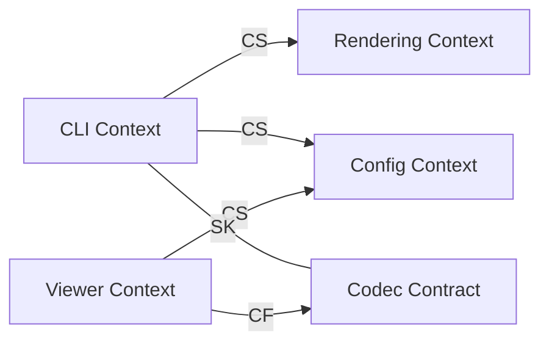

# Context Map

Relationship notes:
- `CLI -> Rendering` uses Customer-Supplier: CLI defines execution contract; renderer supplies artifact capability.
- `CLI/Viewer -> Config` centralizes style interpretation.
- `CLI + Viewer` rely on a shared codec contract so generated URLs remain interoperable.
